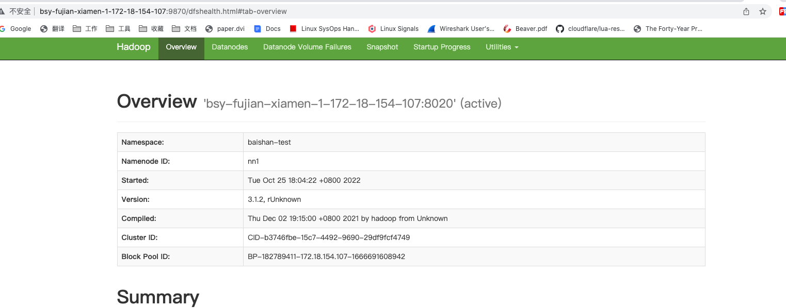

# 基于ZK搭建Hadoop测试集群


### 1、JDK 

查看目前支持安装的 JDK 版本

```shell
yum search java | grep jdk
```

选择JDK版本，并安装

```shell
yum install -y java-1.8.0-openjdk java-1.8.0-openjdk-devel.x86_64
```

检查是否安装成功

```shell
java -version
```

### 2、配置 JAVA_HOME

在 centos 系统中使用 yum 安装 jdk 的默认安装目录在 `/usr/lib/jvm/` 下

```shell
echo 'export JAVA_HOME=/usr/lib/jvm/jre-1.8.0-openjdk-1.8.0.345.b01-1.el7_9.x86_64' >> /etc/profile
echo 'export PATH=$JAVA_HOME/bin:$PATH' >> /etc/profile
source /etc/profile
```


### 3、创建 Hadoop 用户

```shell
useradd hadoop
```

### 4、集群规划

一共三台服务器，设备角色都一致

```shell
172.18.154.107  ZK+NameNode+JournalNode+ResourceManager+DataNode+NodeManager
172.18.154.201  ZK+NameNode+JournalNode+ResourceManager+DataNode+NodeManager
172.18.154.224  ZK+NameNode+JournalNode+ResourceManager+DataNode+NodeManager
```

### 5、部署 ZooKeeper

从官网下载[安装包](https://zookeeper.apache.org)，解压安装

```shell
tar -zxf zookeeper-3.4.13.tgz -C /opt/
cd /opt/
mv zookeeper-3.4.13/ zookeeper
chown -R hadoop:hadoop /opt/zookeeper
chmod -R 777 /opt/zookeeper
su - hadoop
```

三台设备分别修改配置文件

```shell
cd /opt/zookeeper/

# 172.18.154.107
cat zkData/myid
1

# 172.18.154.201
cat zkData/myid
2

# 172.18.154.224
cat zkData/myid
3

# 修改zoo.cfg配置，三台配置都一致
cat conf/zoo.cfg
server.1:bsy-fujian-xiamen-1-172-18-154-107:2888:3888
server.2:bsy-fujian-xiamen-1-172-18-154-201:2888:3888
server.3:bsy-fujian-xiamen-1-172-18-154-224:2888:3888
```

三台设备启动 ZK 集群，查看集群状态

```shell
/opt/zookeeper/bin/zkServer.sh start
/opt/zookeeper/bin/zkServer.sh status
```


### 6、部署 Hadoop

从官网下载[安装包](https://www.apache.org/dyn/closer.cgi/hadoop/common )，解压安装

```shell
tar -zxf hadoop-3.1.2.tgz -C /opt/
mv /opt/hadoop-3.1.2/ /opt/hadoop
chown -R hadoop:hadoop /opt/hadoop
chmod -R 777 /opt/hadoop
echo 'export HADOOP_HOME=/opt/hadoop' >> /etc/profile
echo 'export PATH=$HADOOP_HOME/bin:$HADOOP_HOME/sbin:$PATH' >> /etc/profile
source /etc/profile
su - hadoop
```

三台设备配置一致，分别编辑下面配置文件

修改 core-site.xml

```shell
vim /etc/hadoop/etc/hadoop/core-site.xml

# hdfs name
<property>
<name>fs.defaultFS</name>
<value>hdfs://baishan-test</value>
</property>

# zookeeper
<property>
<name>ha.zookeeper.quorum</name>
<value>bsy-fujian-xiamen-1-172-18-154-107:2181,bsy-fujian-xiamen-1-172-18-154-201:2181,bsy-fujian-xiamen-1-172-18-154-224:2181</value>
</property>
```

修改 hdfs-site.xml，指定 namenode、journalnode 节点

```shell
vim /etc/hadoop/etc/hadoop/hdfs-site.xml

<property>
  <name>dfs.nameservices</name>
  <value>baishan-test</value>
</property>

<property>
  <name>dfs.ha.namenodes.baishan-test</name>
  <value>nn1,nn2,nn3</value>
</property>

<property>
  <name>dfs.namenode.rpc-address.baishan-test.nn1</name>
  <value>bsy-fujian-xiamen-1-172-18-154-107:8020</value>
</property>

<property>
  <name>dfs.namenode.rpc-address.baishan-test.nn2</name>
  <value>bsy-fujian-xiamen-1-172-18-154-201:8020</value>
</property>

<property>
  <name>dfs.namenode.rpc-address.baishan-test.nn3</name>
  <value>bsy-fujian-xiamen-1-172-18-154-224:8020</value>
</property>

<property>
  <name>dfs.namenode.http-address.baishan-test.nn1</name>
  <value>bsy-fujian-xiamen-1-172-18-154-107:9870</value>
</property>

<property>
  <name>dfs.namenode.http-address.baishan-test.nn2</name>
  <value>bsy-fujian-xiamen-1-172-18-154-201:9870</value>
</property>

<property>
  <name>dfs.namenode.http-address.baishan-test.nn3</name>
  <value>bsy-fujian-xiamen-1-172-18-154-224:9870</value>
</property>

<property>
  <name>dfs.namenode.shared.edits.dir</name>
  <value>qjournal://bsy-fujian-xiamen-1-172-18-154-107:8485;bsy-fujian-xiamen-1-172-18-154-201:8485;bsy-fujian-xiamen-1-172-18-154-224:8485/baishan-test</value>
</property>

<!-- 多少块数据盘被DataNode吃掉 -->
<property>
<name>dfs.datanode.data.dir</name>
<value>/data/0/dfs/dn</value>
</property>
```

修改 mapred-site.xml， 指定 jobhistory 服务

```shell
vim /etc/hadoop/etc/hadoop/mapred-site.xml

<property>
<name>mapreduce.jobhistory.address</name>
<value>bsy-fujian-xiamen-1-172-18-154-107:10020</value>
</property>

<property>
<name>mapreduce.jobhistory.webapp.address</name>
<value>bsy-fujian-xiamen-1-172-18-154-107:19888</value>
</property>
```

修改 yarn-site.xml

```shell
vim /etc/hadoop/etc/hadoop/yarn-site.xml

<property>
    <name>hadoop.zk.address</name>
    <value>bsy-fujian-xiamen-1-172-18-154-107:2181,bsy-fujian-xiamen-1-172-18-154-201:2181,bsy-fujian-xiamen-1-172-18-154-224:2181</value>
</property>
<property>
    <name>yarn.resourcemanager.ha.enabled</name>
    <value>true</value>
</property>
<property>
    <name>yarn.resourcemanager.ha.rm-ids</name>
    <value>rm1,rm2,rm3</value>
</property>
<property>
    <name>yarn.resourcemanager.hostname.rm1</name>
    <value>bsy-fujian-xiamen-1-172-18-154-107</value>
</property>
<property>
    <name>yarn.resourcemanager.hostname.rm2</name>
    <value>bsy-fujian-xiamen-1-172-18-154-201</value>
</property>
<property>
    <name>yarn.resourcemanager.hostname.rm3</name>
    <value>bsy-fujian-xiamen-1-172-18-154-224</value>
</property>
<property>
    <name>yarn.resourcemanager.address.rm1</name>
    <value>bsy-fujian-xiamen-1-172-18-154-107:8032</value>
</property>
<property>
    <name>yarn.resourcemanager.address.rm2</name>
    <value>bsy-fujian-xiamen-1-172-18-154-201:8032</value>
</property>
<property>
    <name>yarn.resourcemanager.address.rm3</name>
    <value>bsy-fujian-xiamen-1-172-18-154-224:8032</value>
</property>
```

修改 hadoop-env.sh，主要配置相关服务可用资源

```shell
vim /etc/hadoop/etc/hadoop/yarn-site.xml

export HDFS_NAMENODE_USER=hadoop
export HDFS_DATANODE_USER=hadoop
export HDFS_SECONDARYNAMENODE_USER=hadoop
export YARN_RESOURCEMANAGER_USER=hadoop
export YARN_NODEMANAGER_USER=hadoop

export JAVA_HOME=/usr/lib/jvm/jre-1.8.0-openjdk-1.8.0.345.b01-1.el7_9.x86_64

# NameNode
export HDFS_NAMENODE_JMX_OPTS="-Dcom.sun.management.jmxremote.authenticate=false -Dcom.sun.management.jmxremote.ssl=false -Dcom.sun.management.jmxremote.local.only=false -Dcom.sun.management.jmxremote.port=9871 -javaagent:/opt/hadoop/share/hadoop/common/jmx_prometheus_javaagent-0.16.1.jar=17106:/opt/hadoop/etc/hadoop/namenode-jmx.yaml"
export HDFS_NAMENODE_JVM_OPTS="-Xms1G -Xmx1G -XX:+UseG1GC -XX:+UseStringDeduplication"
export HDFS_NAMENODE_OPTS="$HDFS_NAMENODE_OPTS $HDFS_NAMENODE_JMX_OPTS $HDFS_NAMENODE_JVM_OPTS"

# DataNode
export HDFS_DATANODE_JMX_OPTS="-Dcom.sun.management.jmxremote.authenticate=false -Dcom.sun.management.jmxremote.ssl=false -Dcom.sun.management.jmxremote.local.only=false -Dcom.sun.management.jmxremote.port=9872 -javaagent:/opt/hadoop/share/hadoop/common/jmx_prometheus_javaagent-0.16.1.jar=17107:/opt/hadoop/etc/hadoop/datanode-jmx.yaml"
export HDFS_DATANODE_JVM_OPTS="-Xms512M -Xmx512M -XX:+UseG1GC -XX:+UseStringDeduplication"
export HDFS_DATANODE_OPTS="$HDFS_DATANODE_OPTS $HDFS_DATANODE_JMX_OPTS $HDFS_DATANODE_JVM_OPTS"

# JournalNode
export HDFS_JOURNALNODE_JVM_OPTS="-Xms512M -Xmx512M -XX:+UseG1GC -XX:+UseStringDeduplication"
export HDFS_JOURNALNODE_JMX_OPTS="-Dcom.sun.management.jmxremote.authenticate=false -Dcom.sun.management.jmxremote.ssl=false -Dcom.sun.management.jmxremote.local.only=false -Dcom.sun.management.jmxremote.port=9873 -javaagent:/opt/hadoop/share/hadoop/common/jmx_prometheus_javaagent-0.16.1.jar=17108:/opt/hadoop/etc/hadoop/journalnode-jmx.yaml"
export HDFS_JOURNALNODE_OPTS="$HDFS_JOURNALNODE_OPTS $HDFS_JOURNALNODE_JVM_OPTS $HDFS_JOURNALNODE_JMX_OPTS"

# zkfc
export HDFS_ZKFC_JVM_OPTS="-Xms128M -Xmx128M -XX:+UseG1GC -XX:+UseStringDeduplication"
export HDFS_ZKFC_OPTS="$HDFS_ZKFC_OPTS $HDFS_ZKFC_JVM_OPTS"

# ResourceManager
export YARN_RESOURCEMANAGER_JVM_OPTS="-Xms1G -Xmx1G -XX:+UseG1GC -XX:+UseStringDeduplication"
export YARN_RESOURCEMANAGER_JMX_OPTS="-Dcom.sun.management.jmxremote.authenticate=false -Dcom.sun.management.jmxremote.ssl=false -Dcom.sun.management.jmxremote.local.only=false -Dcom.sun.management.jmxremote.port=17001 -javaagent:/opt/hadoop/share/hadoop/common/jmx_prometheus_javaagent-0.16.1.jar=17201:/opt/hadoop/etc/hadoop/resourcemanager-jmx.yaml"
export YARN_RESOURCEMANAGER_OPTS="$YARN_RESOURCEMANAGER_OPTS $YARN_RESOURCEMANAGER_JVM_OPTS $YARN_RESOURCEMANAGER_JMX_OPTS"

# NodeManager
export YARN_NODEMANAGER_JVM_OPTS="-Xms512M -Xmx512M -XX:+UseG1GC -XX:+UseStringDeduplication"
export YARN_NODEMANAGER_JMX_OPTS="-Dcom.sun.management.jmxremote.authenticate=false -Dcom.sun.management.jmxremote.ssl=false -Dcom.sun.management.jmxremote.local.only=false -Dcom.sun.management.jmxremote.port=17002 -javaagent:/opt/hadoop/share/hadoop/common/jmx_prometheus_javaagent-0.16.1.jar=17202:/opt/hadoop/etc/hadoop/nodemanager-jmx.yaml"
export YARN_NODEMANAGER_OPTS="$YARN_NODEMANAGER_OPTS $YARN_NODEMANAGER_JVM_OPTS $YARN_NODEMANAGER_JMX_OPTS"

# TimelineServer
export YARN_TIMELINESERVER_JVM_OPTS="-Xms128M -Xmx128M -XX:+UseG1GC -XX:+UseStringDeduplication"
export YARN_TIMELINESERVER_OPTS="$YARN_TIMELINESERVER_OPTS $YARN_TIMELINESERVER_JVM_OPTS"

# JobHistoryServer
export MAPRED_HISTORYSERVER_JVM_OPTS="-Xms128M -Xmx128M -XX:+UseG1GC -XX:+UseStringDeduplication"
export MAPRED_HISTORYSERVER_OPTS="$MAPRED_HISTORYSERVER_OPTS $MAPRED_HISTORYSERVER_JVM_OPTS"
```

### 7、启动 Hadoop

三台机器都hadoop用户操作，启动 journalnode 服务

```shell
hdfs --daemon start journalnode

[hadoop@bsy-fujian-xiamen-1-172-18-154-107 ~]$ jps
11780 Jps
7225 QuorumPeerMain
11338 JournalNode
```

格式化元数据，只能在第一台机器上做，生产环境千万不要执行！！

```shell
[hadoop@bsy-fujian-xiamen-1-172-18-154-107 hadoop]$ hdfs namenode -format
[hadoop@bsy-fujian-xiamen-1-172-18-154-107 hadoop]$ hdfs --daemon start namenode
```

另外两台机器，也启动 namenode

```shell
[hadoop@bsy-fujian-xiamen-1-172-18-154-201 hadoop]$ hdfs namenode -bootstrapStandby
[hadoop@bsy-fujian-xiamen-1-172-18-154-201 hadoop]$ hdfs --daemon start namenode

[hadoop@bsy-fujian-xiamen-1-172-18-154-224 hadoop]$ hdfs namenode -bootstrapStandby
[hadoop@bsy-fujian-xiamen-1-172-18-154-224 hadoop]$ hdfs --daemon start namenode
```

第一台机器上格式化 zkfs

```shell
[hadoop@bsy-fujian-xiamen-1-172-18-154-107 hadoop]$ hdfs zkfc -formatZK
```

三台机器上都启动 zkfs
```shell
[hadoop@bsy-fujian-xiamen-1-172-18-154-107 hadoop]$ hdfs --daemon start zkfc
[hadoop@bsy-fujian-xiamen-1-172-18-154-201 hadoop]$ hdfs --daemon start zkfc
[hadoop@bsy-fujian-xiamen-1-172-18-154-224 hadoop]$ hdfs --daemon start zkfc

[hadoop@bsy-fujian-xiamen-1-172-18-154-107 hadoop]$ jps
12961 Jps
12100 NameNode
7225 QuorumPeerMain
11338 JournalNode
12860 DFSZKFailoverController
```

### 8、添加 Datanode

添加 Datanode 节点

```shell
[root@bsy-fujian-xiamen-1-172-18-154-224 opt]# mkdir /data/0/dfs/dn -p
[root@bsy-fujian-xiamen-1-172-18-154-224 opt]# chown -R hadoop:hadoop /data
[root@bsy-fujian-xiamen-1-172-18-154-224 opt]# su - hadoop
[hadoop@bsy-fujian-xiamen-1-172-18-154-224 ~]$ hdfs --daemon start datanode
[hadoop@bsy-fujian-xiamen-1-172-18-154-107 ~]$ tail -10 /opt/hadoop/logs/hadoop-hadoop-datanode-bsy-fujian-xiamen-1-172-18-154-107.log
```

### 9、管理平台

上面的步骤把 HDFS 搭建完毕，可以通过 namenode 的 9870 端口进行管理页面访问验证。




### 10、文件操作

```shell
[hadoop@bsy-fujian-xiamen-1-172-18-154-107 ~]$ hdfs dfs -ls /
[hadoop@bsy-fujian-xiamen-1-172-18-154-107 ~]$ hdfs dfs -mkdir hdfs://baishan-test/lzl
[hadoop@bsy-fujian-xiamen-1-172-18-154-107 ~]$ cd /opt/hadoop/
[hadoop@bsy-fujian-xiamen-1-172-18-154-107 hadoop]$ hdfs dfs -put README.txt hdfs://baishan-test/lzl
```
